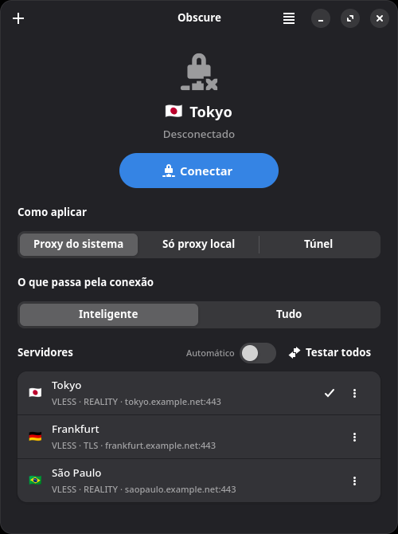
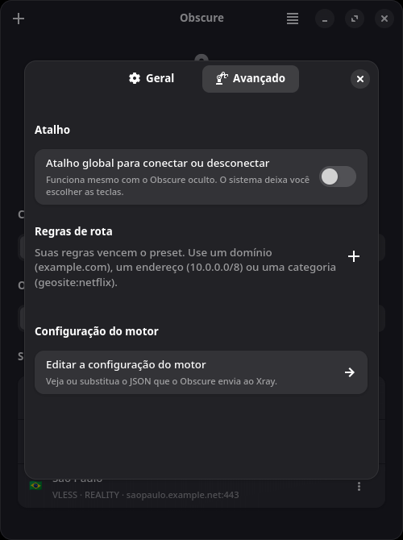

<div align="center">


# Obscure

**Connect. That's it.**

A simple, modern Linux client for the [Xray-core](https://github.com/XTLS/Xray-core) engine,
built with Rust, GTK4 and libadwaita.

[](https://github.com/talesam/Obscure-Desktop/actions/workflows/ci.yml)
[](LICENSE)
[](https://www.rust-lang.org/)
[](https://gtk.org/)
[](https://gnome.pages.gitlab.gnome.org/libadwaita/)
[](https://github.com/XTLS/Xray-core)
[](po/LINGUAS)
[](#installation)

</div>

---

Obscure is for people who just want to connect. Paste a link, press **Connect**, done.
No protocol names on the main screen, no configuration files, no root.

## Highlights

- **One button.** Connect / Disconnect is the whole main screen. Everything technical lives under *Advanced*.
- **Works without root.** The default mode sets the desktop's system proxy (GNOME and KDE) and restores it when you disconnect, quit, or after a crash. A tunnel mode that routes *all* traffic is available and asks for your password once, through polkit.
- **Brings its own engine.** Xray-core is downloaded on first connection from the official release, verified with SHA‑256, and kept up to date. Geo data is refreshed daily.
- **Imports anything.** `vless://`, `vmess://`, `trojan://`, `ss://`, `wireguard://`, `socks://` links, subscription URLs, text files, QR codes from an image, from the clipboard or straight from the screen. Links clicked in a browser open in Obscure.
- **Subscriptions as groups**, with traffic quota and expiry, refreshed automatically.
- **Knows where you are going.** Country flag per server (offline lookup, no third-party service), latency test for all servers, and an *Automatic: fastest server* mode.
- **Live connections view.** A terminal-like stream showing what is going where: via the server, direct, or blocked.
- **Stays in the tray.** Monochrome icon that follows your theme, notifications, autostart with the session.
- **Errors in plain language.** The raw engine log is one click away when you want it.
- **Speaks your language.** English plus 28 translations.

## Screenshots

| Main window | Preferences → Advanced |
|---|---|
|  |  |

## Installation

### Arch Linux / Manjaro

A `PKGBUILD` is provided in [`pkgbuild/`](pkgbuild/) (date-based version, used by the CI):

```bash
git clone https://github.com/talesam/Obscure-Desktop.git
cd Obscure-Desktop/pkgbuild
makepkg -si
```

### Flatpak (development manifest)

```bash
flatpak install flathub org.gnome.Platform//50 org.gnome.Sdk//50 \
  org.freedesktop.Sdk.Extension.rust-stable//25.08
flatpak-builder --user --install --force-clean build-flatpak \
  build-aux/io.github.talesam.Obscure.Devel.json
flatpak run io.github.talesam.Obscure.Devel
```

### From source

Dependencies: `rust` ≥ 1.92, `gtk4` ≥ 4.22, `libadwaita` ≥ 1.9, `blueprint-compiler`, `meson`,
`ninja`, `gettext`, `desktop-file-utils`, `appstream`.

```bash
meson setup build --prefix=/usr
meson compile -C build
sudo meson install -C build
```

For a development build that runs uninstalled (app ID `io.github.talesam.Obscure.Devel`):

```bash
meson setup build -Dprofile=development
meson compile -C build
./build/crates/obscure-app/obscure
```

## Usage

1. Press **+** (or `Ctrl+V` anywhere in the window) and paste a server link or a subscription URL.
2. Choose **how to apply**: *System proxy* (default, no root), *Local proxy only* (127.0.0.1:2080), or *Tunnel* (all traffic, asks for permission once).
3. Press **Connect**. The first time, Obscure downloads the engine (about 66 MB).

Useful extras:

- `Ctrl+L` opens **Live Connections**; the menu also has the **Connection Log**.
- **Test All** measures every server; turn on **Automatic** to always connect to the fastest one.
- **Preferences → Advanced**: your own route rules, the raw engine configuration with validation, and a system-wide shortcut to connect or disconnect.
- **Copy Environment Variables** in the menu gives you `http_proxy`/`all_proxy` lines for terminals.

## How it works

```
obscure (GTK4/libadwaita, unprivileged)
  └─ obscure-core (Rust library, no GTK)
       ├─ downloads and verifies Xray-core        ~/.local/share/obscure/core/
       ├─ generates config.json from the profile  ~/.cache/obscure/config.json
       ├─ supervises the xray process (restart with backoff)
       ├─ reads traffic stats over gRPC, parses the access log
       └─ applies/restores the system proxy (GSettings, kioslaverc)
obscure-helper (root via polkit, only for tunnel mode)
  └─ grants CAP_NET_ADMIN/CAP_NET_RAW to the xray binary, path-validated
```

Xray runs as a separate process, downloaded at runtime; Obscure never runs as root and never uses setuid binaries.

## Supported protocols

| Protocol | Transports | Security |
|---|---|---|
| VLESS | TCP, WebSocket, gRPC, XHTTP, HTTPUpgrade, mKCP | TLS, REALITY (XTLS Vision) |
| VMess | TCP, WebSocket, gRPC, XHTTP, HTTPUpgrade, mKCP | TLS |
| Trojan | TCP, WebSocket, gRPC | TLS |
| Shadowsocks | TCP/UDP | incl. 2022 ciphers |
| WireGuard | — | — |
| SOCKS5 / HTTP upstream | TCP | optional TLS |

## Project layout

| Path | Contents |
|---|---|
| `crates/obscure-core` | GTK-free library: links, subscriptions, config, engine download, supervisor, stats, system proxy, geo, tunnel |
| `crates/obscure-app` | The GTK4/libadwaita application (`.blp` UI files in `src/ui/`) |
| `crates/obscure-helper` | Minimal privileged helper for tunnel mode (pkexec CLI and D-Bus prototype) |
| `data/` | Desktop entry, AppStream metainfo, GSettings schema, polkit action, icons, CSS |
| `po/` | Translations (English source, 28 languages) |
| `build-aux/` | Flatpak manifest, vendored Cargo sources, build scripts |
| `pkgbuild/` | Arch Linux packaging |
| `docs/PLANO.md` | Design decisions and roadmap (Portuguese) |

## Development

```bash
cargo fmt --all -- --check
cargo clippy --workspace --all-targets -- -D warnings
cargo test --workspace
meson test -C build
```

End-to-end test against a real server (uses a share link from the environment, never stored):

```bash
OBSCURE_TEST_XRAY=~/.local/share/obscure/core OBSCURE_TEST_LINK='vless://…' \
  cargo test -p obscure-core --test integration -- --nocapture
```

After changing Cargo dependencies, regenerate the Flatpak sources with
[`flatpak-cargo-generator.py`](https://github.com/flatpak/flatpak-builder-tools/tree/master/cargo):

```bash
python3 flatpak-cargo-generator.py Cargo.lock -o build-aux/cargo-sources.json
```

## Translations

UI strings are written in English and translated through gettext. Update the catalogs with
`meson compile -C build obscure-pot obscure-update-po` and edit the files in `po/`.
Currently available: Bulgarian, Czech, Danish, German, Greek, Spanish, Estonian, Finnish, French,
Hebrew, Croatian, Hungarian, Icelandic, Italian, Japanese, Korean, Dutch, Norwegian Bokmål, Polish,
Portuguese, Brazilian Portuguese, Romanian, Russian, Slovak, Swedish, Turkish, Ukrainian and Chinese.

## Acknowledgements

- [Xray-core](https://github.com/XTLS/Xray-core) — the engine.
- [Loyalsoldier/v2ray-rules-dat](https://github.com/Loyalsoldier/v2ray-rules-dat) — geo data.
- [gtk-rs](https://gtk-rs.org/), [libadwaita](https://gnome.pages.gitlab.gnome.org/libadwaita/), [Blueprint](https://gitlab.gnome.org/GNOME/blueprint-compiler) — the toolkit.

## License

[GPL-3.0-or-later](LICENSE). Xray-core is downloaded separately at runtime and distributed under its own license.
